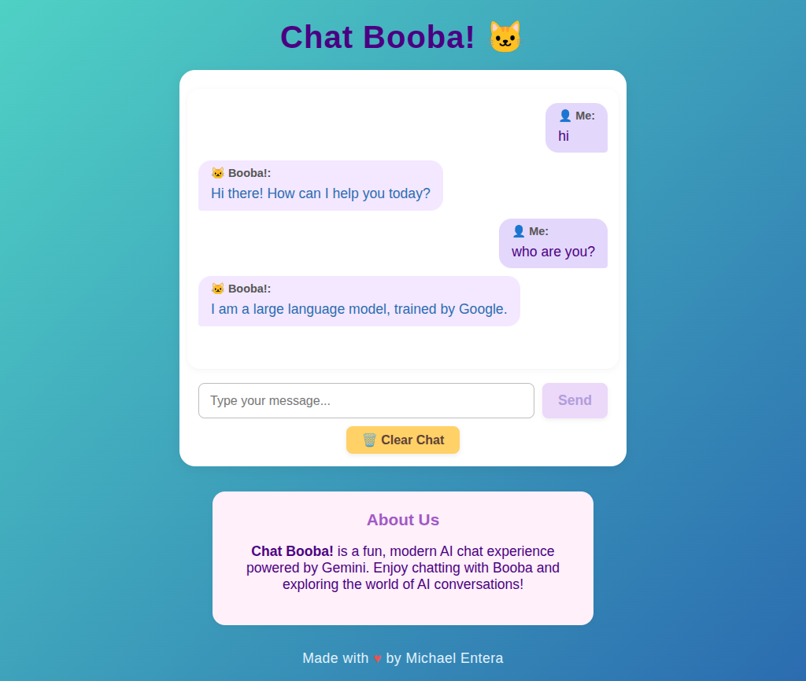

# Chat Booba! 🐱

Chat Booba! is a fun, modern AI chat experience powered by Gemini. Enjoy chatting with Booba and exploring the world of AI conversations!

## Features
- Real-time chat interface
- AI-powered responses (Gemini)
- Modern, responsive design
- Clear chat and stop response controls
- About section

## Screenshot



## Getting Started

### Prerequisites
- Node.js (v14 or higher recommended)

### Installation
1. Clone this repository:
   ```bash
   git clone <repo-url>
   cd chat-booba
   ```
2. Install dependencies:
   ```bash
   npm install
   ```

### Running the App
Start the server:
```bash
node server.js
```

Open your browser and go to [http://localhost:3000](http://localhost:3000) (or the port specified in your server).

## Project Structure
```
chat-booba/
  public/
    chat-booba.svg      # Favicon
    index.html          # Main HTML file
    style.css           # Styles
    screenshot.png      # App screenshot
  server.js             # Server code
  package.json          # Project metadata
```

## License
MIT

---
Made with ❤️ by Michael Entera
